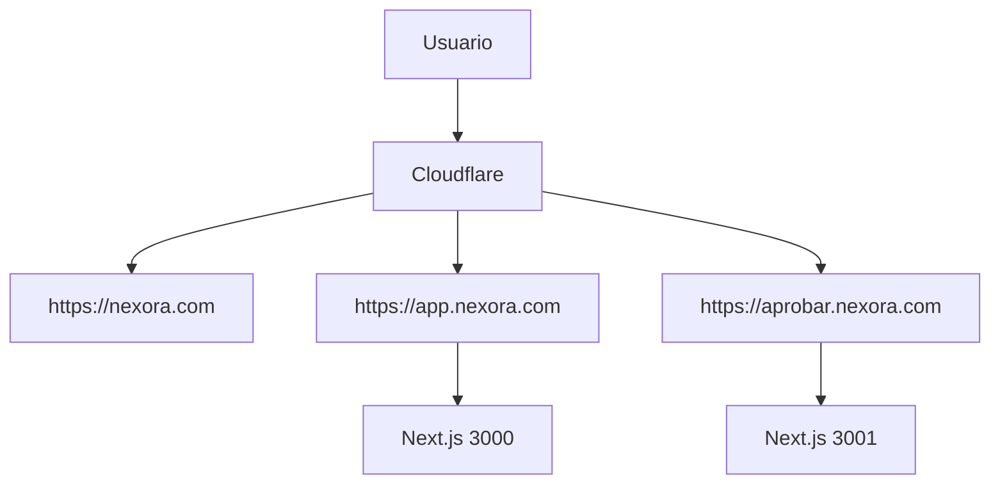
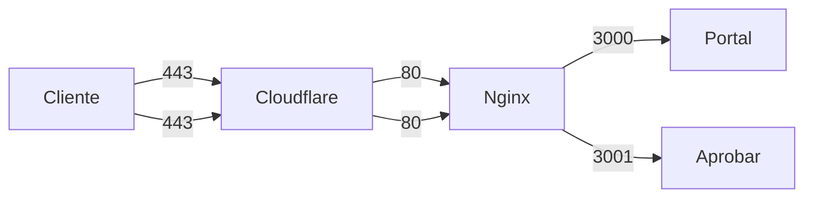

# Infraestructura

## Dominios

| Dominio | Destino |
|---------|---------|
| `nexora.com` | Sitio público y marketing |
| `app.nexora.com` | Portal de clientes (Next.js) |
| `aprobar.nexora.com` | Módulo de aprobación de pagos |

## Cloudflared

1. Instala `cloudflared` según tu sistema operativo.
2. Autentica el túnel:
   ```bash
   cloudflared tunnel login
   ```
3. Crea el túnel que exponga los servicios internos:
   ```bash
   cloudflared tunnel create portal
   ```
4. Define las reglas de ingreso en `~/.cloudflared/config.yml`:
   ```yaml
   tunnel: portal
   ingress:
     - hostname: app.nexora.com
       service: http://localhost:3000
     - hostname: aprobar.nexora.com
       service: http://localhost:3001
     - service: http_status:404
   ```
5. Ejecuta el túnel:
   ```bash
   cloudflared tunnel run portal
   ```

### Renovar tokens

Los tokens de Cloudflare expiran periódicamente. Para renovarlos:

```bash
cloudflared tunnel login        # Regenera credenciales
cloudflared tunnel run portal   # Reinicia el servicio
```

## Diagramas

### Arquitectura



### Puertos expuestos


